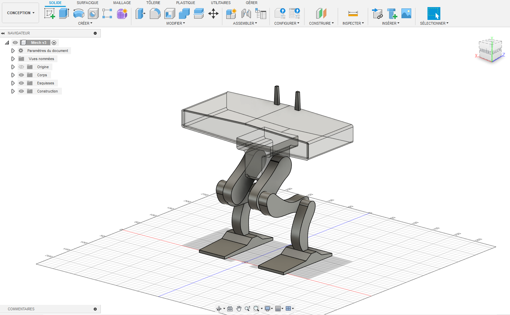

# ROBEO

Goal of the repo is to learn about robotics and slowly get back to CAD designs in Fusion 360.

## Design

From ideation to Fusion 360 CAD files

## Inverse Kinematics equations and system design

## Wishlist of purchases

-  [DC power supply](https://www.amazon.fr/Alimentation-commutation-alimentation-dencodeur-interrupteur/dp/B0CZ92WTQ3/ref=sr_1_2_sspa?crid=1KP2DKI4DRWE8&dib=eyJ2IjoiMSJ9.h7KpUxLzbp2u0DC-eb6mF-8AT9Sr7KdlnpBayZi66mrrjYG1EMsjKHjvlKPLnuL2o8STWiFq4Y5GeuDoF4cIKd8HixhrZXJ5FbpLsw6AaEAMmkriLhwvkMN07xKhLCktkW7s6eXRwdQghgShx7yKMu0M8rt7lEa0jn7Hhusl7XIWlFSoT26FyFS2kZp5L5nCDhSSkLcDDobRjyD0hMHjPNPbKjRxRrwOEBWpwaoS3YvNExenq9d6IS-xdF3_YpcoLSiDmPRaF3-1RBCD2FgCzSX56iGQS3_4rD41mlMS7tA.2tLYog-vOUv0c14NZfgRM32ovD8WfcIhPFKfgrPusSQ&dib_tag=se&keywords=power%2Bsupply%2Bcontrol%2B12v&qid=1752486169&sprefix=power%2Bsu%2Caps%2C92&sr=8-2-spons&sp_csd=d2lkZ2V0TmFtZT1zcF9hdGY&th=1)
- [Caliper](https://www.amazon.fr/Qfun-Inoxydable-conversion-Eclaboussures-lindustrie/dp/B082XBZJS5/ref=sr_1_1_sspa?__mk_fr_FR=%C3%85M%C3%85%C5%BD%C3%95%C3%91&crid=C808H39DMDCR&dib=eyJ2IjoiMSJ9.vWr0DlJnOb6m-d1sDFBMUDs6Zbe6tsJhYlCiCHuh_bxR0M9VW9TeHdjCjwvEyM1flCSLhDoz8kaQu9T6iNgBv_dsyv4K6L2dPGMgNBJQvO1Bg8JnAoJlice6QtJUdkOqLALVD6qgDGErTbSAF_i5ogXbJuT0kvijeE8LaGUNOD6tViokTYSt7g2CHFvsZFjinYgznlRh6n4KQKuCfoV7sOCLV3fKa5K5LPhdBGgxqpd_mB_cYDgrXl5pyVKBFI519PvieMEV0qisBIkdNAn8JHK9VO7zzUMNJGTAVBxND6I.a99maBtgXwe4oBFeUJ9zpYVJJv4V-ikwkAgH2yqoi4c&dib_tag=se&keywords=caliper&qid=1752486883&sprefix=caliper%2Caps%2C85&sr=8-1-spons&sp_csd=d2lkZ2V0TmFtZT1zcF9hdGY&psc=1)
- Microcontroller : ESP32, Arduino, Raspbery Pi 4 or 5
- [Eaglepower motor](https://fr.aliexpress.com/item/1005007790507636.html?src=google&pdp_npi=4%40dis!EUR!57.39!57.39!!!!!%40!12000042212426336!ppc!!!&src=google&albch=shopping&acnt=248-630-5778&isdl=y&slnk=&plac=&mtctp=&albbt=Google_7_shopping&aff_platform=google&aff_short_key=UneMJZVf&gclsrc=aw.ds&&albagn=888888&&ds_e_adid=&ds_e_matchtype=&ds_e_device=c&ds_e_network=x&ds_e_product_group_id=&ds_e_product_id=fr1005007790507636&ds_e_product_merchant_id=486198869&ds_e_product_country=FR&ds_e_product_language=fr&ds_e_product_channel=online&ds_e_product_store_id=&ds_url_v=2&albcp=20180143335&albag=&isSmbAutoCall=false&needSmbHouyi=false&gad_source=1&gad_campaignid=20180156550&gclid=CjwKCAjw1dLDBhBoEiwAQNRiQVzW5aGp3e4I0hIHtT97GYVKJoebNBdKK6efyAQEIQjKn5t8onR68BoCnLoQAvD_BwE)
- [Driver's board]()
- [Battery]()
- [3D printer](https://eu.store.bambulab.com/fr/products/p1s?srsltid=AfmBOor8mUgwGmhB6G_dnUh1ubC66Rgea4OTfnJ4GpnpTR_xDaT0Vjnw)
- [Screwdrivers set](https://www.ifixit.com/en-eu/products/manta-driver-kit-112-bit-driver-kit?gad_source=1&gad_campaignid=22040920003&gclid=CjwKCAjw1dLDBhBoEiwAQNRiQYlRd4Uiod_hbH2iITm-KDiF-YX4-q5clM2oCIw-W6dhMGornnbetxoC0QYQAvD_BwE)
- [Soldering station](https://www.amazon.fr/Preciva-927IV-Auxiliaires-Ajustable-Thermostat/dp/B0D62WQ93C/ref=asc_df_B0D62WQ93C?mcid=4b2889146bba3619b2af67e799666703&tag=googshopfr-21&linkCode=df0&hvadid=701618516094&hvpos=&hvnetw=g&hvrand=15070868564892272922&hvpone=&hvptwo=&hvqmt=&hvdev=c&hvdvcmdl=&hvlocint=&hvlocphy=9055006&hvtargid=pla-2344098760946&hvocijid=15070868564892272922-B0D62WQ93C-&hvexpln=0&th=1)